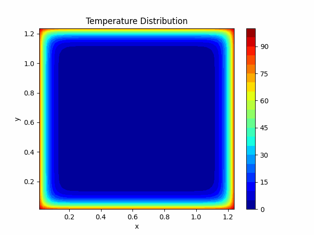

# Diffusion-Equation-PINN
In this notebook, you'll see an introduction to PINN, and Diffusion Equation, this was a part of my Deep Learning Project @ University of Trieste

## Overview

You can open this notebook on Google Colab to experiment with the code and concepts covered here. The main topics include:

* Numerical Analysis
* Deep Learning
* Diffusion Equation

The objective of this notebook is to introduce you to an application of PINNs to a square plate that heats.

## Features
Analysis and visualization of the diffusion equation on a square plate.
Implementation of a Residual Feed Forward Neural Network to solve the diffusion equation.
Application to inverse problem (diffusion coefficient pointwise estimation).

## How to Use
1. Clone the repository:
git clone https://github.com/YuriPaglierani/Diffusion-Equation-PINN.git
cd your-repo
Or

2. Go directly to the Google Colab Notebook https://colab.research.google.com/drive/1NBlTypkwmjmMmTyQXD7gRDP9H33uezXB?usp=sharing

## Things to Try
Integrate with Advanced Techniques, like Fourier Neural Operators.

Use also the boundary conditions to have a better coherence with the solution we want to model (there is the class Pinn2 for this)

Use libraries that make PINNs friendly (try for example this open source framework PINA https://mathlab.github.io/PINA/_rst/tutorials/tutorial1/tutorial.html)

## License
This project is licensed under the MIT License - see the LICENSE file for details.

## Contacts
If you have any questions or suggestions, feel free to contact me on LinkedIn (Yuri Paglierani)

## Visualization
Below there is an example of the Diffusion Equation over a 2D plate with Dirichlet Boundary Conditions

  

